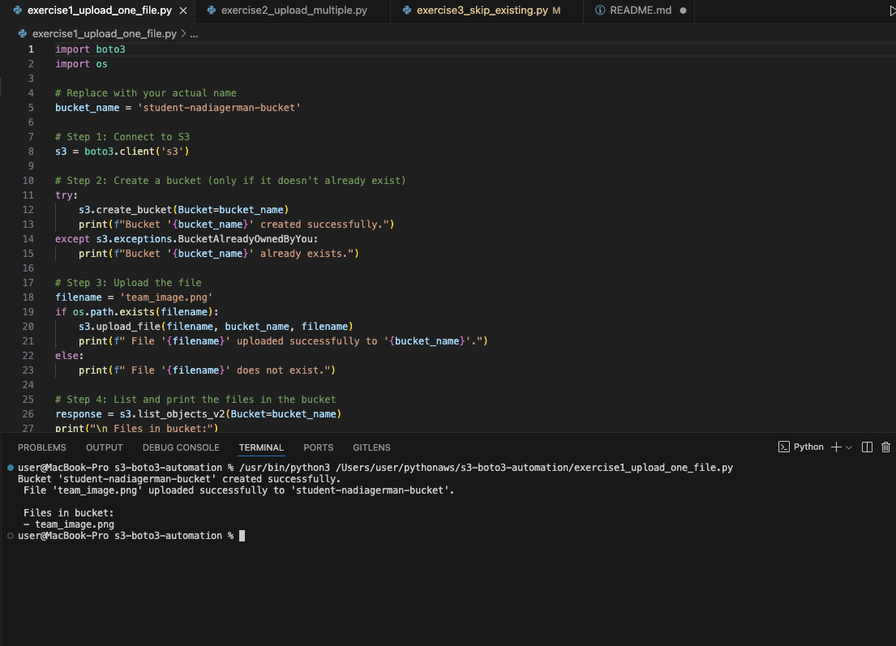

# s3-boto3-automation
# 🗂️ S3 Boto3 Automation Project

This project demonstrates how to automate file uploads to AWS S3 using Python and the `boto3` library.

---

## ✅ Exercises

### 🔹 Exercise 1: Upload One File
- Creates a bucket called `student-nadiagerman-bucket`
- Uploads `team_image.png`
- Lists bucket contents

---

### 🔹 Exercise 2: Upload Multiple Files
- Uploads all `.txt` files from the `daily_documents` folder
- Bucket: `student-nadiagerman-backup`

---

### 🔹 Exercise 3: Skip Existing Files
- Skips files already uploaded to avoid duplication

---

## 📂 GitHub Repository

All code is available at:  
🔗 [https://github.com/NadiaGerman/s3-boto3-automation](https://github.com/NadiaGerman/s3-boto3-automation)

---

## 🛠 Technologies Used
- Python 3
- AWS CLI
- boto3
- Git + GitHub

---

## 🧪 Test Files Used
- `team_image.png`
- `file1.txt`, `file2.txt`, `file3.txt` in `daily_documents/`

---

## 🙋‍♀️ Submitted by:
**Nadia German**  
Email: gilgofnadia@gmail.com
